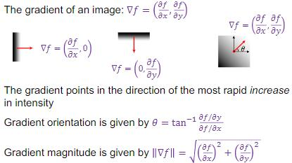
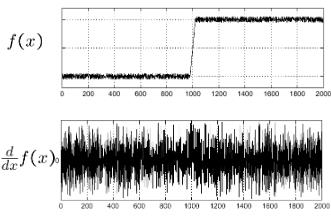
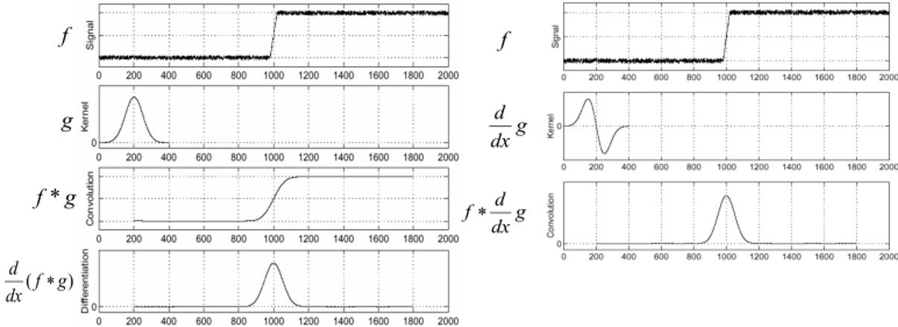
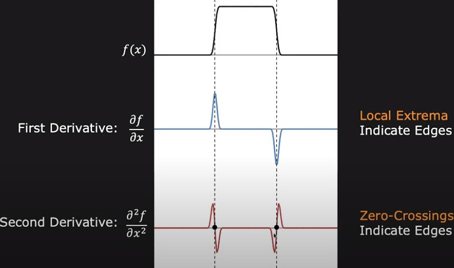

# Edge Detection

## Edge detection using gradients
An edge is a place of rapid change in the image intensity 
function.

### Partial derivatives of an image
for 2D function $f(x, y)$, the partial derivative w.r.t. $x$ is
$$
\frac{\partial f(x, y)}{\partial x}=\lim _{\varepsilon \rightarrow 0} \frac{f(x+\varepsilon, y)-f(x, y)}{\varepsilon}
$$
For **discrete data**, we can approximate using finite differences:
$$
\frac{\partial f(x, y)}{\partial x}=\frac{f(x+1, y)-f(x, y)}{1}
$$

### Gradient
$\bigtriangledown f =  (\frac{\partial f}{\partial x}, \frac{\partial f}{\partial y})$, pronounced as **Del**



### Gradient Operators

Kernel size affects localization and noise sensitive.

### Derivative of Gaussian (DoG)
#### image corrupted by additive Gaussian noise


#### Smooth by gaussian filter

Take derivatives of Gaussian filtered image = apply DoG to image directly

#### Gaussian vs DoG
Gaussian:
- remove “high-frequency” components;  “low-pass” filter
- Can the weights' values of a smoothing filter be negative? No
- The values sum to **One**: constant regions are not affected by the filter

DoG:
- Can the values of a derivative filter be negative?
- Can the weights' values of a smoothing filter be negative? Yes
- The values sum to **Zero**: no response in constant regions

An edge is a place of rapid change in the image intensity 
function.

### Partial derivatives of an image
for 2D function $f(x, y)$, the partial derivative w.r.t. $x$ is
$$
\frac{\partial f(x, y)}{\partial x}=\lim _{\varepsilon \rightarrow 0} \frac{f(x+\varepsilon, y)-f(x, y)}{\varepsilon}
$$
For **discrete data**, we can approximate using finite differences:
$$
\frac{\partial f(x, y)}{\partial x}=\frac{f(x+1, y)-f(x, y)}{1}
$$

### Gradient
$\bigtriangledown f =  (\frac{\partial f}{\partial x}, \frac{\partial f}{\partial y})$, pronounced as **Del**


### Gradient Operators

Kernel size affects localization and noise sensitive.

### Derivative of Gaussian (DoG)
#### image corrupted by additive Gaussian noise


#### Smooth by gaussian filter

Take derivatives of Gaussian filtered image = apply DoG to image directly

#### Gaussian vs DoG
Gaussian:
- remove “high-frequency” components;  “low-pass” filter
- Can the weights' values of a smoothing filter be negative? Yes
- **One**:constant regions are not affected by the filter

DoG:
- Can the values of a derivative filter be negative?
- Can the weights' values of a smoothing filter be negative? No
- **Zero**: zero resoponse

## Edge threshold 
See another page
- Part of segmentation
- OTSU learn how to implement and lib 
- Fuzzy Method (To be implemented)

## Laplacian($\bigtriangledown^{2}$) as edge detector


$\bigtriangledown^{2} f = \frac{\partial^{2} f}{\partial x^{2}}+\frac{\partial^{2} f}{\partial y^{2}}$

## Canny Edge Detector


```python
import cv2
import numpy as np
from matplotlib import pyplot as plt
from mpl_toolkits import mplot3d
from skimage import io as io_url
from func.otsu import otsu_threshold
```


```python
frame = io_url.imread('images/scotty.jpg', as_gray=True)
k = 7 # Kernel size

sobel_x = cv2.Sobel(frame,-1,1,0,ksize=k)
sobel_y = cv2.Sobel(frame,-1,0,1,ksize=k)
magnitude = np.sqrt(sobel_x**2 + sobel_y**2)
orientation = np.arctan2(sobel_y, sobel_x) * (180 / np.pi) % 180
laplacian = cv2.Laplacian(frame,-1,ksize=k)

data = 255*magnitude/magnitude.max()
data = data.astype(np.uint8)
ret,th = cv2.threshold(data,0,255,cv2.THRESH_BINARY+cv2.THRESH_OTSU)

```

Here is a fancy way to subplot


```python
(fig, axs) = plt.subplots(nrows=2, ncols=3, figsize=(16, 8))
axs = axs.ravel() # flaten 2D array

# plot each of the images
axs[0].imshow(frame, cmap="gray")
axs[1].imshow(np.abs(sobel_x)/np.abs(sobel_x).max(), cmap='gray');
axs[2].imshow(np.abs(sobel_y)/np.abs(sobel_y).max(), cmap='gray');
axs[3].imshow(magnitude/magnitude.max(), cmap='gray');
axs[4].imshow(th, cmap='gray');
axs[5].imshow(laplacian, cmap='gray');

# set the titles of each subplot
axs[0].set_title('Original');
axs[1].set_title('Sobel X');
axs[2].set_title('Sobel Y');
axs[3].set_title('Gradient Magnitude');
axs[4].set_title('Gradient Magnitude after otsu thresholding');
axs[5].set_title('Laplacian');


# loop over each subplot axs and turn off x and y ticks
for i in range(0,6):
    axs[i].set_xticks([]); axs[i].set_yticks([]);

plt.tight_layout()
plt.show()
```


    

    

